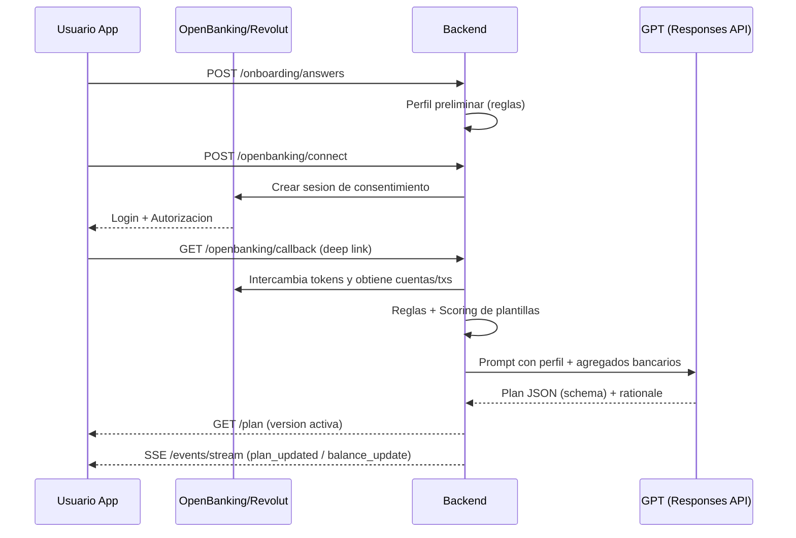

# Revplan — aplicación de finanzas conectada a Revolut

> **TL;DR**: App móvil + backend conectados a **Revolut** que usan **IA (fórmula propia + GPT personalizado)** para crear el **mejor plan financiero** para cada usuario y sus objetivos. El plan **se modifica de forma continua** conforme evolucionan tus finanzas y **aprende** con tus hábitos y feedback.

---

## 🧩 Propuesta de negocio

**Problema**
Las apps de finanzas personales suelen mostrar datos, pero **no te dicen qué hacer**: cuánto ahorrar este mes, cómo priorizar deudas o cuándo subir/bajar el colchón. Además, cuando cambia tu saldo, **el plan sigue igual**.

**Solución**
**Revplan** crea un **plan financiero vivo**. Hace preguntas rápidas (edad, ingresos, riesgo, deudas, objetivos), conecta con tu banco (Revolut) y **calcula el plan óptimo** combinando **reglas deterministas** y un **GPT personalizado**. Cuando cambian tus saldos/ingresos, **recalcula** y te lo refleja al instante.

**Usuarios objetivo**

* Personas con cuenta **Revolut** que quieren **automatizar** su presupuesto y su ahorro.
* Profesionales con ingresos variables y foco en **liquidez**.
* Ahorradores que buscan **disciplina suave** y **recomendaciones accionables**.

**Propuesta de valor**

* **Plan accionable** (no sólo gráficas): cuánto apartar y dónde.
* **Ajuste automático** con datos reales (saldos/transacciones).
* **Privacidad por diseño**: mínimo dato al GPT y cifrado de tokens.
* **Reglas transparentes** + explicación del GPT.

**Diferenciadores**

* **IA propia**: fórmula propietaria + GPT personalizado que elige y ajusta el plan óptimo; el plan evoluciona y aprende con la actividad y feedback.
* Motor de **plantillas ponderadas** (p. ej. *Emergencia Rápida*, *Equilibrado 50/30/20*, *Antideuda Avalanche*, *Inversión Progresiva*).
* **Recalculo continuo** con webhooks/cron y **stream** en tiempo real a la app.
* **LLM** sólo para **ajustes y redacción** (salida **JSON Schema** controlada).

---

### IA de Revplan (fórmula propia + GPT personalizado)

* Usamos **IA** para llevar los planes financieros **a otro nivel**: combinamos una **fórmula propietaria** (scoring y reglas por plantilla) con un **GPT personalizado** que selecciona el plan óptimo y ajusta parámetros finos para cada usuario según su **perfil y objetivos**.
* El plan es **dinámico y evolutivo**: a medida que cambian saldos/ingresos y el usuario aporta **feedback**, recalculamos y **aprendemos** de los hábitos de gasto/ahorro para afinar límites, porcentajes y alertas.
* La salida del GPT es **estructurada (JSON Schema)** para mantener trazabilidad y control; nunca enviamos PII innecesaria.

---

## 🏗️ Arquitectura (alto nivel)

```mermaid
flowchart LR
  subgraph Mobile["App Movil (React Native / Expo)"]
    M1[Onboarding · Preguntas rapidas]
    M2[Dashboard y Presupuesto]
    M3[Conectar Revolut]
  end

  subgraph Backend["Backend (Spring Boot / Java 21)"]
    B1[OpenBanking · Tink/GoCardless o Revolut Business]
    B2[Survey y Profile]
    B3[Plan Engine · Reglas y Scoring]
    B4[LLM Adapter · Responses API (GPT)]
    B5[Sync Service · Cron/Webhooks]
    B6[Events · SSE/WebSocket]
  end

  subgraph Data["PostgreSQL"]
    D1[(Usuarios y Consentimientos)]
    D2[(Cuentas y Transacciones)]
    D3[(Perfiles y Respuestas)]
    D4[(PlanVersion y KPIs)]
  end

  M1 -->|/onboarding| B2
  M3 -->|/openbanking/connect| B1
  B1 -->|Balances/Txs| D2
  B5 --> D2
  B2 --> B3
  D2 --> B3
  B3 --> B4
  B4 -->|Plan JSON| D4
  D4 --> M2
  B6 -->|plan_updated, balance_update| M2
  M2 <--> B6
```

### Flujo principal (simplificado)



---

## 📦 Estructura del monorepo

```
revplan/
├─ apps/
│  ├─ mobile/                 # React Native (Expo)
│  └─ backend/                # Spring Boot (Java 21) multi-módulo
│     ├─ openbanking/         # conector Tink/GoCardless/Revolut Business
│     ├─ plan-engine/         # reglas, plantillas, scoring y KPIs
│     ├─ llm-adapter/         # cliente Responses API (GPT)
│     └─ gateway/             # (opcional) edge, CORS, rate limit
├─ packages/
│  ├─ shared-schemas/         # OpenAPI + JSON Schema (plan/onboarding)
│  └─ shared-kpis/            # fórmulas compartidas
├─ infra/
│  ├─ docker/                 # docker-compose.dev, mocks, ngrok
│  ├─ k8s/                    # manifiestos/helm (si aplica)
│  └─ terraform/              # IaC
├─ docs/                      # ADR, runbooks, diagramas
└─ .github/workflows/         # CI/CD por app/módulo
```

---

## 🔌 API (MVP) — Endpoints clave

* `GET /onboarding/questions` → cuestionario dinámico
* `POST /onboarding/answers` → guarda respuestas y devuelve perfil preliminar
* `POST /openbanking/connect` → inicia consentimiento y devuelve URL
* `GET /openbanking/callback` → callback OAuth/OB
* `GET /accounts` → cuentas habilitadas con balances
* `GET /transactions?accountId=...` → transacciones
* `GET /plan/templates` → catálogo de plantillas y parámetros
* `POST /plan/generate` → genera plan con reglas + GPT (JSON Schema)
* `GET /plan` → plan activo + KPIs
* `PUT /plan` → ajustes manuales del plan
* `POST /plan/recompute` → recalcula KPIs (tras sync)
* `GET /events/stream` → **SSE/WS** con `plan_updated`, `balance_update`, `kpi_update`

**Plantillas ejemplo**: `EMERGENCIA_RAPIDA`, `EQUILIBRADO_50_30_20`, `ANTIDEUDA_AVALANCHE`, `INVERSION_PROGRESIVA`.

**Scoring** (esbozo):

```
score(template) = w1*risk_match + w2*liquidity_fit + w3*debt_fit
                + w4*savings_gap_fit + w5*age_fit + w6*stability_fit
```

---

## 🧠 IA (fórmula propia + GPT personalizado) — uso responsable

* Usamos IA para **llevar los planes a otro nivel**: las **reglas** y la **fórmula propietaria** generan un borrador y el GPT **selecciona la mejor plantilla** y **ajusta** (±2–5%) explicando los trade-offs.
* Salida **estructurada**: Responses API con `response_format: json_schema`.
* **Datos mínimos**: perfil + **agregados** de gasto y saldo (sin PII ni IBAN completo).
* **Evolución y aprendizaje**: el sistema re-entrena parámetros de reglas y umbrales con datos agregados y tu feedback (no supervisado + heurísticas), manteniendo historiales de versión del plan.

Ejemplo de salida JSON (resumido):

```json
{
  "template_id": "EQUILIBRADO_50_30_20",
  "adjustments": {
    "saving_pct": 0.27,
    "emergency_months": 7,
    "envelopes": { "variables": 0.28, "fijos": 0.45, "objetivos": 0.27 }
  },
  "rationale": "texto breve",
  "alerts": ["Ajusta ocio si superas 10% del límite"]
}
```

---

## 🔐 Privacidad y cumplimiento (GDPR)

* **Consentimiento** explícito y revocable desde la app.
* **Tokens** de Open Banking cifrados en servidor; **Secure Storage** en móvil.
* **Minimización de datos** al LLM; anonimización donde aplique.
* **HTTPS** obligatorio; **TLS pinning** opcional en móvil.
* **Derechos**: acceso/exportación/supresión de datos.
* Mensajes push **sin PII** (abre la app para ver detalle).
* Aviso: contenido **informativo**; no asesoramiento financiero/fiscal.

> **Nota Revolut**: Para **cuentas personales**, la API PSD2 de Revolut requiere ser **TPP regulado**. En el MVP se usa un **agregador** (p. ej. Tink o GoCardless). Para **Revolut Business**, puede usarse su **Business API** directamente.

---

## 🧪 Requisitos & stack

* **Mobile**: Node 20+, Expo CLI, iOS/Android SDK.
* **Backend**: Java 21, Gradle/Maven, Postgres (local o Docker).
* **Infra dev**: Docker (opcional), ngrok para callbacks OB (opcional).

---

## ⚡ Puesta en marcha (dev)

1. **Clonar** el repo y crear `.env` (ver variables abajo).
2. **Backend** (ejemplo Gradle):

   ```bash
   cd apps/backend
   ./gradlew :openbanking:bootRun
   ./gradlew :plan-engine:bootRun
   ./gradlew :llm-adapter:bootRun
   ```
3. **Móvil** (Expo):

   ```bash
   cd apps/mobile
   npm i
   npm start
   ```
4. Configura el **deep link** `revplan://ob/callback` y **redirect URI** correspondientes.

---

## ⚙️ Variables de entorno (ejemplo)

**Backend**

```
OPENAI_API_KEY=...
OPENAI_MODEL=gpt-4o-mini            # tu GPT personalizado
FINANCE_PROVIDER=tink|gocardless|revolut_business
TINK_CLIENT_ID=...
TINK_CLIENT_SECRET=...
GC_SECRET_ID=...
GC_SECRET_KEY=...
REVOLUT_CLIENT_ID=...               # sólo Business
REVOLUT_CLIENT_SECRET=...           # sólo Business
APP_BASE_URL=https://api.tuapp.com
REDIRECT_URI=revplan://ob/callback
RECOMPUTE_THRESHOLD_PCT=0.05
DB_URL=jdbc:postgresql://localhost:5432/revplan
DB_USER=revplan
DB_PASS=revplan
APP_JWT_SECRET=supersecret
REALTIME_TRANSPORT=sse
```

**Móvil**

```
API_BASE_URL=https://api.tuapp.com
DEEP_LINK_SCHEME=revplan
DEEP_LINK_PATH=ob/callback
```

---

## 🤖 CI/CD

* **GitHub Actions** por app/módulo (lint, tests, build).
* Matrices separadas para móvil/backend.
* Escaneo de secretos (gitleaks/trufflehog).
* Environments: `dev`, `staging`, `prod` con **secretos** segregados.
* Docker images (opcional) publicadas en GHCR.

---

## 🗺️ Roadmap (MVP)

* [ ] Onboarding + catálogo de plantillas y fórmulas.
* [ ] Conector Open Banking (sandbox) + deep links.
* [ ] `/plan/generate` (reglas + GPT) con JSON Schema.
* [ ] Dashboard y presupuesto en móvil (KPIs, sobres).
* [ ] Sync + recompute + **SSE** en app.
* [ ] Seguridad móvil (biometría, secure storage) y políticas de privacidad.
* [ ] Builds internas (TestFlight/Android Internal).

---

## 🤝 Contribución

1. Rama corta desde `main` (`feat/nombre-corto`).
2. Commits con **Conventional Commits**.
3. PR con tests y cobertura verde.
4. ADR en `docs/adr/` si cambias arquitectura.

---

## 📄 Licencia y descargo

* Licencia: por definir (MIT/Apache-2.0 sugeridas).
* **No es asesoramiento financiero**. Ver detalles en `docs/policy/`.

---

## 📞 Contacto

* Autor: Andrés
* Proyecto: Revplan — Plan financiero vivo conectado a Revolut
